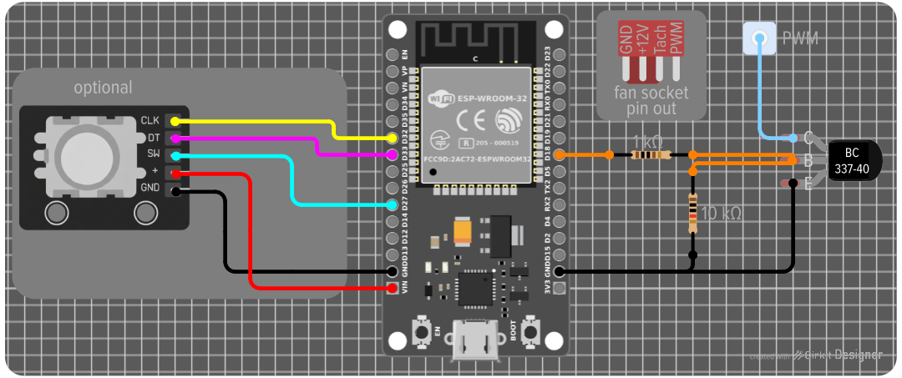

# onAir_fanControl

**a Docker to send realtime HDD temp-data to drive a custom PWM controller over MQTT**

This project sends HDD temperatures of your unRAID server over MQTT, to feed an external ESP to drive your PWM fans. It uses `smartctl` to read temperatures (even when disks are in standby) and lets you conveniently setup a fan curve in its WebUI.
*(as "only" MQTT data is transmitted, you can also use any other device to drive your fans - this project was build around an ESP node, though)*

Other than the hardware requirements (see below), you will need an **unRAID Server** as well **ESPHome** inside of **Home Assistant**.

*This project relied heavily on vibe-coding, in case you are not comfortable with this.*

## Features
- **Intelligent Hysteresis**: Keeps fan speeds (and noise!) stable during minor temperature fluctuations.
- **Standby Support**: Reads temperatures without waking up sleeping drives.
- **Soft Spinning**: Fans are not set to change instantly, this is gentle to the bearings as well as your ears.
- **Semi-Live Monitoring**: Trend graph for temperature vs fan speed.
- **Spundown Support**: Let the speed go down when all disks are spun down - or switch them off completely.
- **Fail-Safe Logic**: The ESP node continues to run even if the network or server connection is lost.
- **Manual Override**: Use a rotary encoder, WebUI, or any HA-remote to add a bias to the fan curve
- **Straightforward UI**: A simple dashboard for easy setup and monitoring.

**what it doesn't do**
This setup is meant to run a PWM signal to multiple PWM fans at once; you can't create individual groups of fans vs HDDs or send individual signals to each fan. 
It is also not designed to return a tach-signal back to the ESP node or mainboard. However, as a PWM fan hub is used to distribute power and PWM signal to all connected fans, you connect its built-in tach-return to your mainboard; this will usually only return the signal of the master-fan (red port), though.

**inner workings**
Only the hottest drive is considered for the fan curve; no average, no math. That way, even during a hefty Parity Check all drives can stay cool. SSDs and flash drives are not considered for the temperature readings.
This Docker mounts `/host`:`/var/local/emhttp/` (read only) to read `disks.ini`. This file contains (cached) temperature data, but more importantly shows if a drive is running, or spun down.
Also, `/dev`: Mount `/dev/` (read only); you have to ensure the container is in **Privileged** mode. This allows `smartctl` to query the drives for real-time SMART temperature data. *If you are not comfortable giving this Docker access to your system like that, you can leave this out; then, only `disks.ini` is used to read temperature data (temps there are not realtime and therefore much less accurate)* 

## Installation

### 0. Setup an MQTT Broker
You need an MQTT Broker to distribute temperature and PWM data. You can use also use an existing one you might already have.
*For this project, I used a dedicated [Mosquitto Docker](https://hub.docker.com/r/eclipse-mosquitto) on my unRAID, even though I already have one inside my Home Assistant; the reasoning was that this controller is not dependent on Home Assistant during operation; like this, it can still run and function even when Home Assistant is down. And without unRAID running, I don't need to cool my HDDs :)*

### 1. unRAID Docker
A) Install via the Community Applications store, or add the template manually.

B) In the WebUI, add your MQTT credentials, and restart the container. With MQTT connected, all necessary topics (listed in the WebUI) get distributed and are usable anywhere you want. You can get familiar with the WebUI if you want.
**Without the suggested ESP node, you will need some other device to utilize the PWM and temp data to drive your fans to make use of this Docker.**

### 3. ESPHome Setup
*Before the ESP gets wired up and put into its place, I recommend installing the firmware first; when this is done, you can wirelessly access and update it down the road.*

A) Install the [ESPHome Add-on](https://esphome.io/guides/getting_started_hassio/) in Home Assistant. After, open the ESPHome Device Builder WebUI, and press "+ New Device" (usually in the lower right corner). Hit "Continue", and then "Import from File" - select the provided `onAir_fanController_ESPHome-template.yaml`. Press "Skip" for now.

B) Hit "EDIT" on the newly created entry; you will need to adjust the connection data to properly install the firmware first.
Update your Wi-Fi (under `wifi:`) and MQTT credentials (under `mqtt:`) in the YAML before flashing; obviously, this has to match the network and MQTT broker that you are using in the Docker. Also, you can set API-encryption, an OTA password, and an Access-Point (ap) password. The latter three can all be removed if you don't want or need them.
On the top of the template (under `subsitutes:`), you can set the hardcoded safety functions (mind the comments next to the values). You can adjust these to taste and simply flash the firmware again later (wirelessly, even inside your server, as mentioned before).

C) *At this point, there are multiple ways to install the firmware, I had most success with the following approach:*
 In the YAML editor, click "INSTALL" in the upper right corner. Select "Manual Install" (this may take some time). When it's done, select "Factory Format (Previously Modern)" and save the file to the computer you are using.

D) Visit [web.esphome.io](https://web.esphome.io). Click on "Connect", now connect your ESP device via USB and select COMx that just showed up, and hit "Connect" (*you might need to install some drivers for this; if no device comes up, hit "Cancel" and follow the instructions).
With the ESP connected, select "Install" and choose the file you created in step C). Hit "Install" and wait for it to finish.

E) Restart the ESP and head back into your Home Assistant. Under Settings → Devices & services, your freshly installed ESP should show up under "Discovered". Click "Add" and follow the usual HA setup.

F) Go to Settings → Devices & services → ESPHome and select `onAir_fanController`. Have a look at all the exposed sensors (they should already populate from the Docker data), maybe you can utilize them in some other other way as well (e.g. colour changing LEDs to warn for high temps).
On the bottom of the page, the IP adress of this ESP is shown; copy it, head to the Docker WebUI, and paste it under Network → ESP Node. Hit "Save" and restart the Docker; now, on top of the page your ESP should show as "online".
*You can also visit this very IP from your browser to access the ESP WebUI; this also works even when Home Assistant is **not** running.*

##### BOARD TYPE / VARIANT ESPHOME?  [!!!?!!!](https://esphome.io/components/esp32/)

### 4. Hardware Setup

#### Hardware BOM for the fan controller
- 1x ESP32 (a ESP8266 would also work)
- 1x BC337-40 transistor
- 1x 1 kΩ Resistor
- 1x 10 kΩ Resistor
- YS10FAN, a most simple PWM fan hub (others might work as well, but I only tested this one) 
- a way to power the ESP on its final location (e.g. internal USB, 5V from your server PSU, connected to the fan hub...)
- wires, soldering iron, connectors, etc.
- Multimeter for general checks etc.
- (optional) KY-040 rotary encoder
- (optional) any kind of Home Assistant-compatible remote control

**If you want or must change any of the GPIO pins, you have to adjust these changes also in the ESPHome YAML file and re-flash it accordingly.** 
A) The circuit is rather simple. I assembled it on a small "zero PCB", but you can also wire it on a breadboard or any way you like.
For a stable PWM signal, you need to put a transistor behind the GPIO. The **BC337-40** has three legs. Pointing up, flat side facing you, the legs are: Collector (C, left leg), Base (B, middle leg), Emitter (E, right leg). **E** has to be connected straight to a **GND** pin of your ESP. **B** needs to be connected through a **1 kΩ resistor** to **GPIO18**, and through a **10 kΩ resistor** to **GND**; two different paths, meeting with **E**, so to say. **C** is the output of our PWM signal and needs to be connected to the PWM input of the fan hub.
**It is also very important that the ESP and the fan hub are connected through GND. I achieved this this by soldering Dupont pins to the 5V input of the fan hubs Molex socket, and powering the whole ESP through them. If you power it e.g. through the internal USB, you can connect a GND pin of the ESP to a GND pin of the fan hub, e.g. from a not used fan connector.**

B) Your fan hub will have one input you'd usually connect to your mainboard, often with only two pins (tach and PWM). To find out which pin is which, you a multimeter set to continuity mode and hold one lead to a defined PWM pin of one of the fan outputs, and the other to each input pin of the fam hub (on my YS10FAN, it was the upper pin when the mainboard input faces left, and the power input faces right). On a fan output socket, when the pins face down and the plastic flap is behind them, the left pin #1 is GND, #2 is +12V, #3 is tach, and #4 is PWM; PWM is the only one that is not "covered" by the plastic flap.
Connect the found PWM input pin to the output of the transistor, and one fan socket GND to a GND pin of the ESP.

C) *(OPTIONAL)* if you want a hard wired encoder to adjust the fan speed, you simply connect the five pins of the KY-040 encoder to the ESP; GND and 5V to their respective pins, CLK to GPIO32, DT to GPIO33, and SW to GPIO27. 

D) *(OPTIONAL)* you can also use any kind of HA-compatible remote control to get the same functionality. Just create an automation in Home Assistant, and link it to the ESPs exposed services. 

You can have a look at my finished abomination in the [/img folder](./img/finishedBuild/).
I used double sided nano-tape to put the ESP and fan hub between the outer wall and optical-drive bay of my server case. I use a Fractal Design R5 with a steel shell, and even there the ESP has a good enough connection to the WiFi; to check in your setup, the link quality is exposed in Home Assistant.
When everything is in place, you can now properly set it up. in the Docker.

## 5. Final Setup

### Docker
Access the Docker WebUI, make sure MQTT and ESP are shown as "online".
Any changes in the settings need to be **saved with the corresponding button**; changes aren't instant in a sense that the MQTT signal will only send in (adjustable) intervals. Also mind the aforementioned soft spinup/spindown.

On the top you will see your current status, like how many disks are spinning, the reported max temperature, and the targeted PWM speed. Under this, you can see a temp vs PWM graph to build up; it will shoe the last 30min, helping you finding the right values for your setup.

Next is **Curve**, where you map temp to PWM%. You can add as many points as you like, either by clicking "add point", or conveniently by double-clicking into the graph next to it. To delete a point, either right click it in the graph or use the "delete" button next to it.
With "Mode" you can choose between a linear interpolation between the points, or a stepped approach for solid plateaus. The red line in the graph indicates the current max temp.

In **General** you can set the frequency for MQTT publishes and disk polls, both in seconds.

**Limits** allows you to cap the min and max PWM values. You can also set a limit for the bias (in percent) that can be applied through the encoder (or ESP WebUI/Home Assistant); this is a safety function to prevent accidentally switching the fans off.

**Misc** adjusts the frequency for the UI auto-refresh, and the **hysteresis**. Hysteresis defines the temperature range in which the fan speed is kept constant; this is to prevent the fan from going up and down all the time. You can adjust it individually for the temp going up and down, this is so a raise in temp will trigger faster fan speeds, but a reduction will blow stable for a little bit longer; or vice versa, it's your server :)

**all HDDs spun down** is an override function to send a dedicated PWM value once all disks are spun down; this value overrides min_pwm set in *Limits* when set lower.

**Network** should already be filled out from the steps during the Installation process; here you need to set MQTT broker credentials as well as the ESPs IP adress (this is only used to ping it for its online status); on the right side are all used MQTT topics, in case you want to know or adjust them.

Finally on the bottom, you have the **raw JSON** config (that you can also change there) for this Docker, as well as a **Log** that shows the current publishes, as well as the source of the temperature - (SMART) or (INI).

### ESP
As mentioned before, you can now also adjust the ESPs hardcoded settings any time; just head to the **ESPHome Device Builder** inside of Home Assistant, select "Edit" on the ESP, and directly change the values in the Editor.
**failsafe_pwm** is the PWM% that gets applied when connection to MQTT is lost/the Docker isn't online and the ESP enters failsafe mode. **stale_seconds** defines how long the ESP will wait for a connection before entering the aforementioned failsafe mode. **failsafe_bias_limit** limits the bias range when failsafe is active, to prevent accidentally switching the fans off. **fan_test_duration_s** defines how many seconds the fans will run at 100% when the exposed `Fan Test (100%)` button is pressed. **bias_timeout_hours** defines after how many hours the bias will reset to 0, in case you forgot that you applied some. *If you want to permanently lower the PWM values, it's recommended to do so in the Docker or the failsafe settings above.*
When done, hit "Save" followed by "Install" on the upper right corner, Select "Wirelessly" and wait for it to finish.

If you are using the encoder: rotating it will add to or subtract from the current PWM%, always following the limits you set. Pressing the encoder will reset the bias to 0. If you want to (additionally) use a HA-copatible remote control, I would recommend the same setup through an automation.
You can also adjust the bias or hit reset through the ESPs WebUI, or Home Assistant.

## Verdict

I hope this project can be useful to you. Before I started this project, I had a PWM controller that only worked manually - I installed this after the fans didn't properly spin up during hot summer days and hot, parity checking drives. This left me with the issue that I couldn't adjust the speed remotely in case I e.g. forgot to raise the speed for a parity check. 
Still, I wanted to control the fans manually with a potentiometer/encoder, while having an automated system based on actual HDD temperatures. This is what got me here.
Maybe it can help you out, as well.
